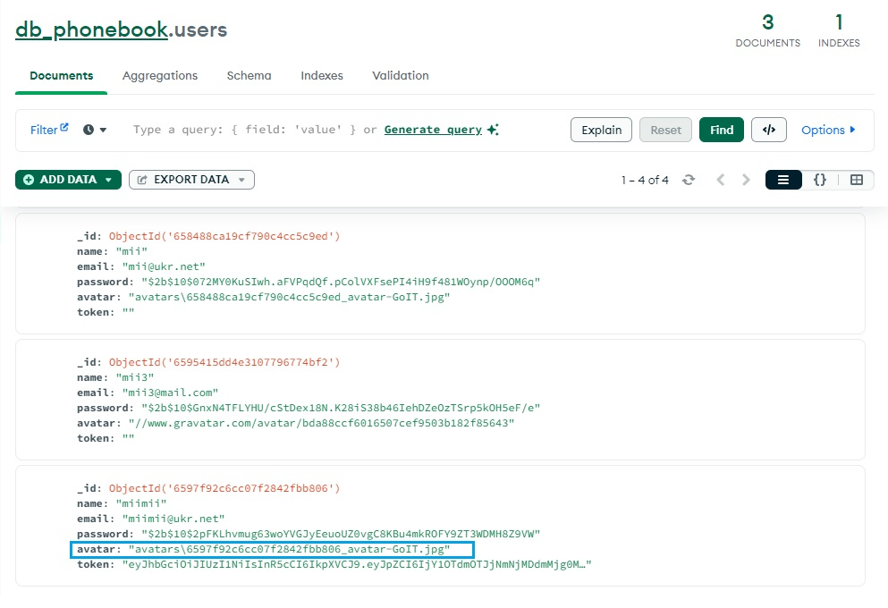

# Add Profile & UpdateProfile

1.  Login miimii@ukr.net - 123456

2.  Go Profile

3.  Update Profile (avatar)

4. Load new avatar

5. Upload avatar

6. Go link Profile (error) 
Profile.jsx:10 Uncaught TypeError: *avatar.includes is not a function* Profile.jsx:10 

7. After reload page go link Profile

8. FIX error

# Add only owner contacts - get / delete

1. Update ContactList.jsx

2. Update contact/operations.js.jsx

3. Update contactsSlice.js

= Finish!  

